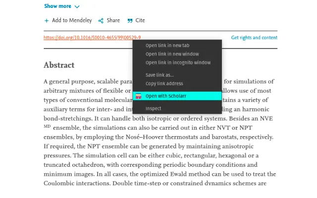

# Scholarr Extension

A google chrome extension to make life of a scholar easier.

## Features:

1. Directly open a link with scihub using DOI link

## Work in progress

1. Copy citation from DOI link

# Attributions

- Book icons created by Smashicons - Flaticon[https://www.flaticon.com/free-icons/book]
